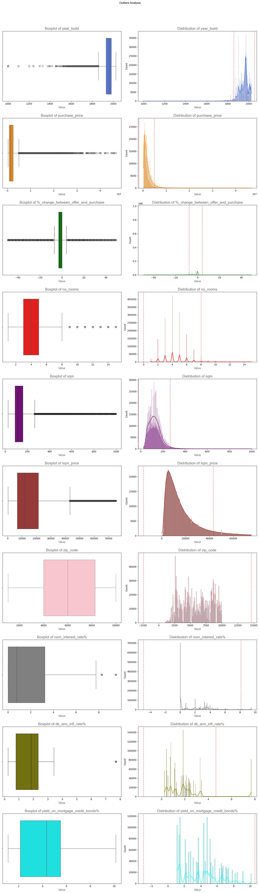

# 📘 02450 - Introduction to Machine Learning and Data Mining (Spring 2025)

Welcome to my repository for the DTU course **02450 – Introduction to Machine Learning and Data Mining**, taken in Spring 2025.

This course covers foundational topics in machine learning, including supervised and unsupervised learning, model evaluation, dimensionality reduction, and data preprocessing. 

Tools such as Python, NumPy, and scikit-learn are used throughout.


---

## 📁 Repository Structure

```plaintext
.
├── Course First Half/
│   ├── Week 1/
│   ├── Week 2/
│   └── ...
├── Course Second Half/
│   ├── Week 8/
│   ├── Week 9/
│   └── ...
├── Project 1/
├── Project 2/
└── README.md
